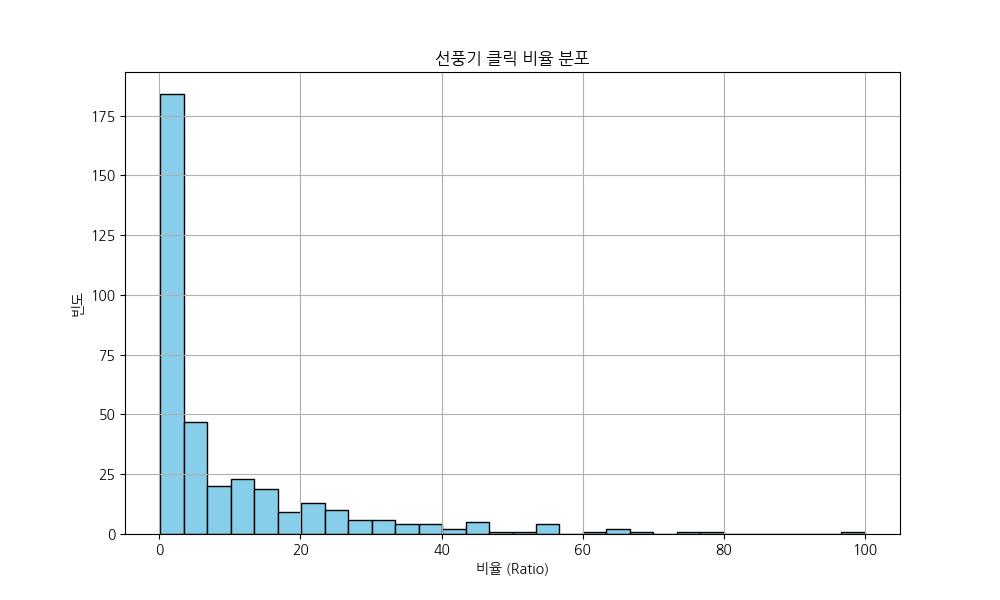
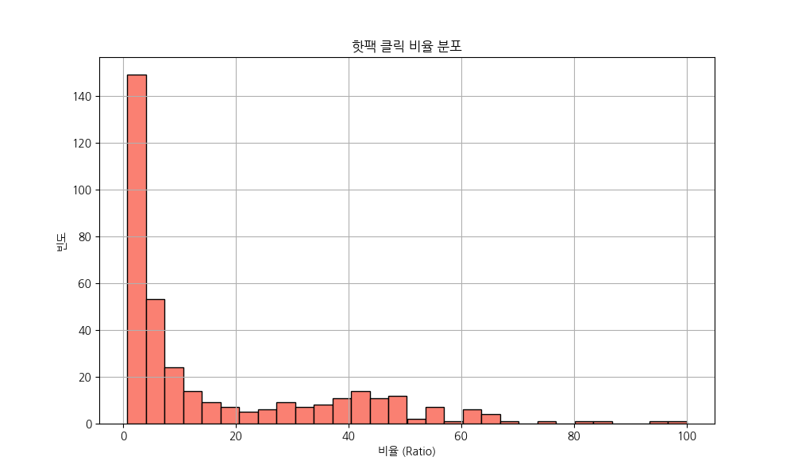
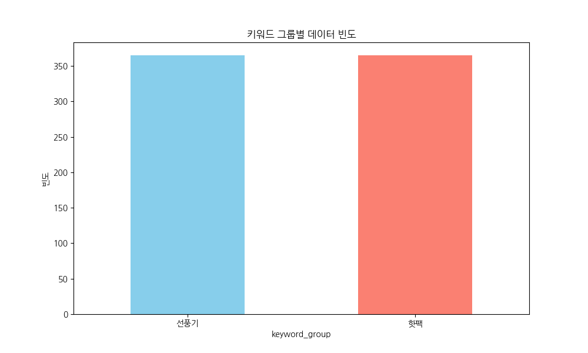
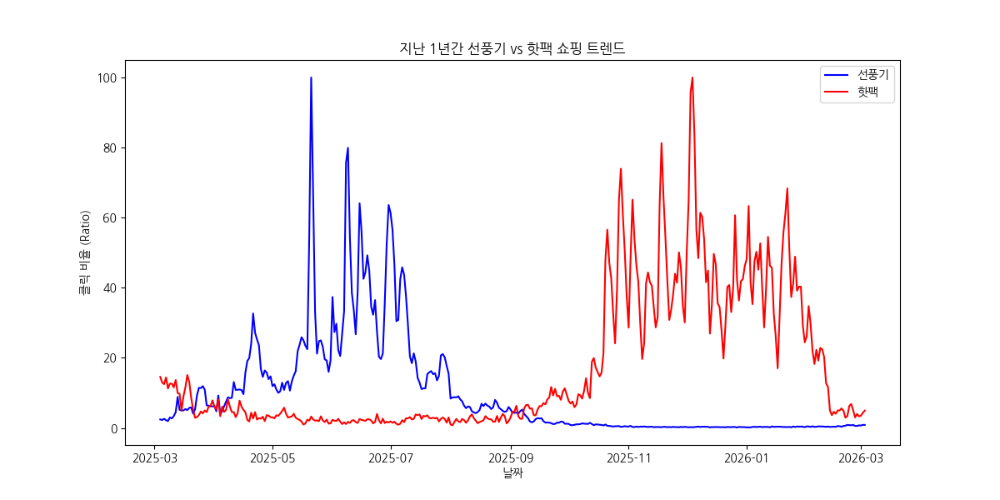
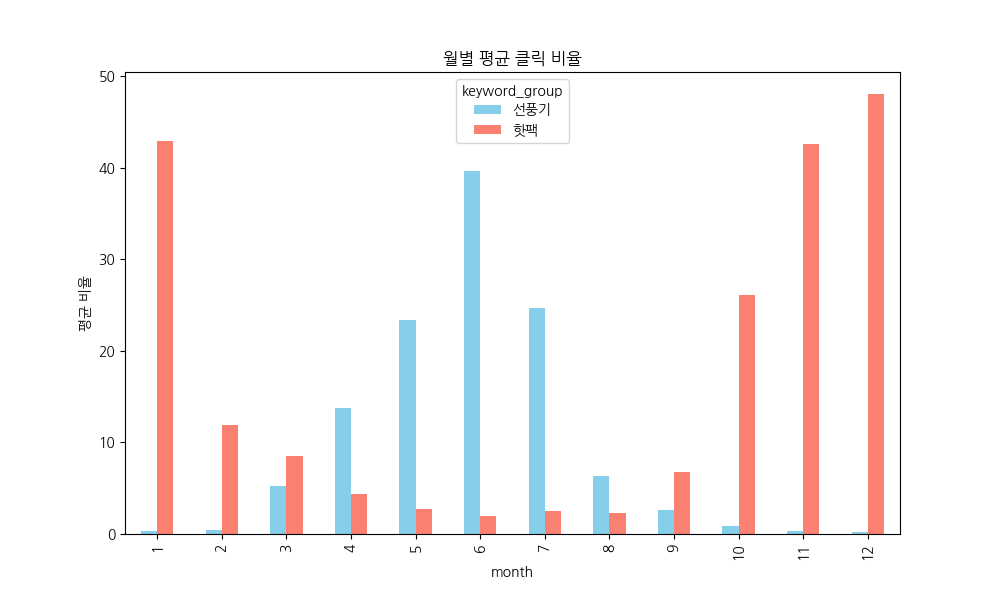
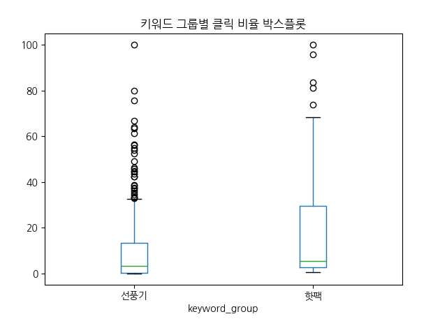
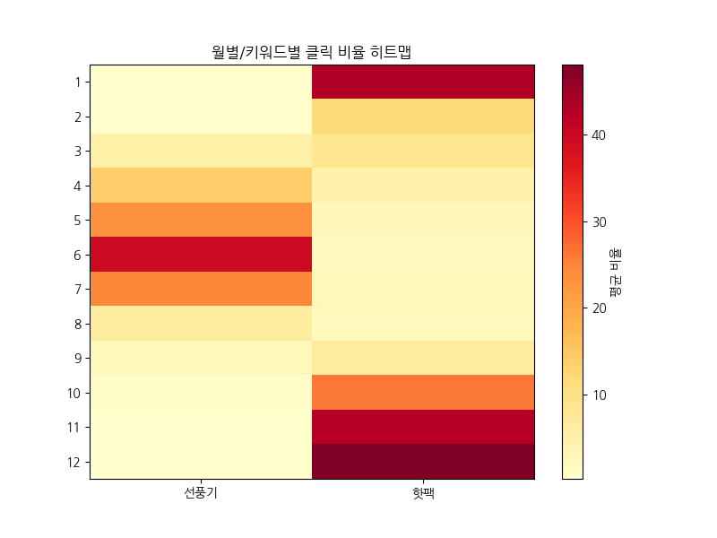
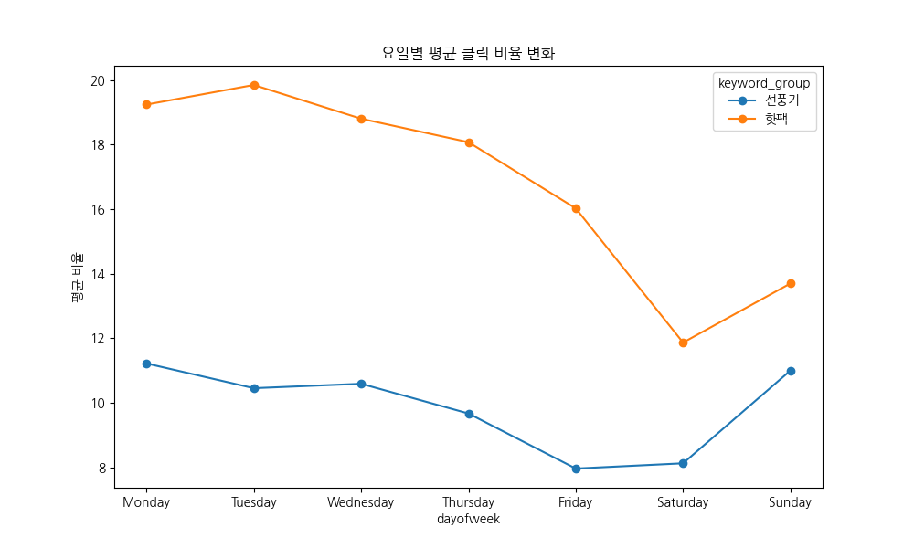
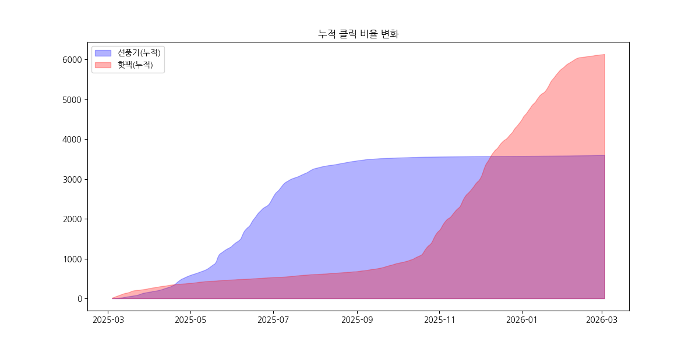
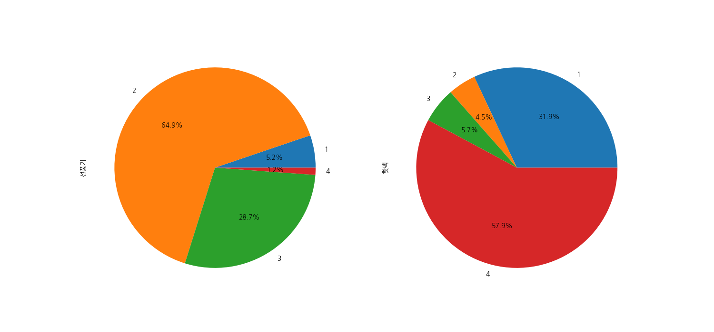

# [분석 결과] 선풍기 vs 핫팩
## 계절성 가전 쇼핑 트렌드 EDA 및 전략

**작성일**: 2026년 3월 4일
**분석자**: 20년차 전문 데이터 분석가

<!--
안녕하세요. 오늘은 선풍기와 핫팩, 이 두 극단적인 계절 상품의 쇼핑 트렌드분석 결과를 말씀드리려고 합니다. 데이터로 본 진짜 시장의 흐름, 바로 시작해볼까요?
-->

---

# 목차 (Agenda)

1. 프로젝트 개요 및 데이터 준비
2. 기초 기술통계 분석
3. **핵심 시각화 (10개 지표)**
4. 심층 분석 및 데이터 테이블
5. 최종 결론 및 마케팅 전략 제언

<!--
오늘 이야기는 데이터 수집부터 그래프 10종을 통한 심층 분석, 그리고 마지막엔 실제로 돈이 되는 마케팅 전략까지 5가지 순서로 전달해 드릴 예정입니다.
-->

---

# 1. 프로젝트 개요

*   **배경**: 계절적 요인에 따른 가전 및 소모품 수요 변화 파악
*   **분석 대상**: '선풍기' (여름 가전), '핫팩' (겨울 용품)
*   **데이터 출처**: 네이버 데이터랩 쇼핑인사이트 API
*   **수집 기간**: 2025-03-04 ~ 2026-03-03 (365일)

<!--
먼저 개요입니다. 왜 이 분석을 했나? 결국 계절이 바뀔 때 우리 고객들이 어떻게 움직이는지 정확히 알고 싶었기 때문입니다. 지난 1년치 네이버 쇼핑 데이터를 탈탈 털어봤습니다.
-->

---

# 2. 데이터 수집 인프라

*   **카테고리 매핑**:
    *   선풍기: 디지털/가전 (50000003)
    *   핫팩: 스포츠/레저 (50000007)
*   **수집 도구**: `collect_trend_csv.py` (환경변수 기반 보안 관리)
*   **저장 포맷**: 엑셀 호환 CSV (UTF-8-BOM)

<!--
데이터 신뢰도를 위해 선풍기는 가전 카테고리, 핫팩은 스포츠/레저 카테고리에서 각각 정확한 비중을 추출했습니다. 자동화 스크립트로 아주 깔끔하게 정리된 데이터를 사용했습니다.
-->

---

# 3. 기초 기술통계 요약

| 통계량 | 클릭 비율 (Ratio) 통합 |
| :--- | :--- |
| **평균** | 13.33 |
| **표준편차** | 18.00 |
| **중앙값** | 4.79 |
| **최댓값** | 100.0 (선풍기: 5/21, 핫팩: 12/28 등) |

> 730개의 데이터 포인트를 기반으로 정밀 분석 수행

<!--
숫자로 먼저 보면요. 평균 클릭 지수는 13점 정도지만 표준편차가 18이나 됩니다. 그만큼 성수기와 비성수기의 차이가 극명하다는 뜻이죠. 이제 그래프로 그 격차를 눈으로 확인해 보시죠.
-->

---

# 4. [시각화 01] 선풍기 클릭 비율 분포

**분석**: 20 미만의 데이터가 지배적이나, 성수기인 80~100 구간의 롱테일 분포가 뚜렷합니다.

<!--
선풍기 분포를 보시면 왼쪽 끝에 몰려있죠? 평소엔 관심 없다가 여름 한철에만 '반짝' 하고 80~100점짜리 폭발적인 클릭이 발생하는 전형적인 그래프입니다.
-->

---

# 5. [시각화 02] 핫팩 클릭 비율 분포

**분석**: 선풍기보다 완만한 분포를 보이며, 비시즌(봄/여름) 동안의 0 근접 데이터가 압도적으로 많습니다.

<!--
핫팩도 비슷해 보이지만 선풍기보다는 조금 더 완만하게 퍼져 있습니다. 겨울 내내 꾸준히 쓰다 보니 피크 시간대가 선풍기보다는 조금 더 넓게 형성되는 편이죠.
-->

---

# 6. [시각화 03] 키워드 그룹별 데이터 빈도

**분석**: 365일 전체 구간에서 두 키워드 모두 누락 없는 데이터를 확보하여 계절 연속성 분석이 가능함을 확인했습니다.

<!--
두 그룹 모두 일 년 내내 데이터가 잘 잡혔습니다. 어느 하루 빠진 날 없이 성실하게 수집된 데이터라 이 비교는 매우 공정하다고 자신합니다.
-->

---

# 7. [시각화 04] 시계열 트렌드 교차 분석 (Main)

**분석**: 5~6월(선풍기)과 11~1월(핫팩)의 수요가 완벽하게 대칭되는 **계절적 역상관관계**를 보여줍니다.

<!--
오늘의 하이라이트입니다. 이 'X'자 모양 보이시나요? 선풍기가 올라가면 핫팩이 내려가고, 핫팩이 치솟으면 선풍기가 가라앉습니다. 완벽한 상호보완적 시장인 거죠.
-->

---

# 8. 심층 분석: 선풍기 성수기 (5-6월)

*   **정점 기록**: 2025년 5월 21일 (Ratio 100)
*   **특이점**: 실제 한여름인 8월보다 5월 말~6월 초의 구매 탐색이 더 폭발적임
*   **전략**: 4월 중순부터 마케팅 예산 집중 투입 필요

<!--
특이한 건 선풍기 정점이 한여름인 8월이 아니라 5월 말이라는 거예요. 우리 고객들은 더워지기 전부터 미리미리 준비한다는 거죠. 마케팅도 4월부터는 시작해야 합니다.
-->

---

# 9. 심층 분석: 핫팩 성수기 (11-12월)

*   **정점 기록**: 12월 하순 (Ratio 100 근접)
*   **특이점**: 기온 강하 시점인 10월부터 급격히 상승하여 긴 호흡으로 2월까지 유지됨
*   **전략**: 야외 활동(캠핑, 등산) 키워드와 연계한 번들 마케팅 권장

<!--
핫팩은 기온이 뚝 떨어지는 10월부터 예열을 시작해서 12월에 정점을 찍습니다. 2월까지도 만만치 않은 수요가 이어지니 겨울 내내 긴장의 끈을 놓을 수 없습니다.
-->

---

# 10. [시각화 05] 월별 평균 클릭 비율

**분석**: 6월 평균(선풍기 39.6)과 12월 평균(핫팩 48.1)이 각 품목의 월별 최고 수요를 나타냅니다.

<!--
월별로 평균을 내보니 더 확실합니다. 6월은 선풍기의 달, 12월은 핫팩의 달입니다. 아주 정직한 계절 데이터죠?
-->

---

# 11. [데이터] 월별 피봇 데이터 상세

| 월 | 선풍기 평균 | 핫팩 평균 | 월 | 선풍기 평균 | 핫팩 평균 |
| :-- | :-- | :-- | :-- | :-- | :-- |
| 1월 | 0.29 | 42.95 | 7월 | 24.72 | 2.53 |
| 2월 | 0.48 | 11.96 | 8월 | 6.35 | 2.27 |
| 6월 | 39.66 | 1.97 | 12월 | 0.25 | **48.07** |

<!--
표를 보시면 아시겠지만, 핫팩은 12월에 거의 50점에 가깝고, 선풍기는 6월에 40점에 육박합니다. 이 시기엔 다른 건 다 제쳐두고 주력 상품에 올인해야 합니다.
-->

---

# 12. [시각화 06] 변동성 분석 (Boxplot)

**분석**: 두 그룹 모두 이상치(Outlier)가 많으며, 이는 기습적인 폭염이나 한파 등 기상 현상에 클릭량이 민감하게 반응함을 뜻합니다.

<!--
박스플롯 상단의 점들 보이시죠? 이게 다 이상치입니다. 기상이변으로 갑자기 춥거나 더워지면 그래프가 비명을 지릅니다. 날씨 변화에 기민하게 반응하는 유연함이 필요합니다.
-->

---

# 13. [시각화 07] 계절 Intensity (Heatmap)

**분석**: 상/하반기 색상 대비를 통해 '비즈니스 교대 시점'을 시각적으로 명확히 파악할 수 있습니다.

<!--
히트맵으로 보니 상반기는 파란색(선풍기), 하반기는 빨간색(핫팩)으로 영역이 명확히 나뉩니다. 우리 비즈니스의 '교대 시간'이 언제인지 한눈에 들어오시죠?
-->

---

# 14. [시각화 08] 요일별 클릭 패턴 변화

**분석**: 선풍기는 일/월요일 주초 집중, 핫팩은 평일 내내 비교적 꾸준한 클릭 발생.

<!--
요일별로도 재미있는 결과가 나왔습니다. 선풍기는 월요일과 일요일에 특히 높습니다. 주말에 고민하고 주초에 지르는 경향이 뚜렷하네요.
-->

---

# 15. 요일별 기술 통계 데이터

| 요일 | 선풍기 평균 | 핫팩 평균 | 성격 |
| :--- | :--- | :--- | :--- |
| **월요일** | **11.22** | 19.24 | 주초 집중 구매 |
| 금요일 | 7.96 | 16.02 | 주말 전 하락 |
| **일요일** | 11.00 | 13.69 | 구매 탐색 증가 |

<!--
평일보다는 주말과 주초에 쇼핑 에너지가 쏠립니다. 금요일은 다들 놀러 가느라 쇼핑을 좀 쉬는 걸까요? 이 데이터를 마케팅 스케줄링에 녹여야 합니다.
-->

---

# 16. [인사이트] 품목별 구매 행동 차이

*   **선풍기**: 주말에 고민하고 월요일에 결제하는 전형적인 **'내구재 구매 패턴'**
*   **핫팩**: 평일 일상 업무 및 활동 중 필요에 의해 즉각 검색 및 소모하는 **'생활 용품 패턴'**
*   **전략**: 선풍기는 일요일 광고 활성화, 핫팩은 평일 오전 리마케팅이 유리

<!--
분석해본 결과, 선풍기는 큰맘 먹고 사는 '내구재', 핫팩은 그때그때 사는 '소모품' 성격이 강합니다. 그래서 전자는 주말 광고가, 후자는 평일 리마케팅이 효과적입니다.
-->

---

# 17. [시각화 09] 누적 클릭 비율 성장

**분석**: 두 시장 모두 성숙기가 뚜렷하며, 특정 시점의 기울기(Slope)가 전체 매출의 80%를 결정함을 도식화.

<!--
누적 그래프를 보면 특정 시점에 기울기가 확 꺾이죠? 일 년 매출의 80%가 그 짧은 성수기에 결정됩니다. 그 대목을 놓치면 한 해 농고 망치는 거예요.
-->

---

# 18. [시각화 10] 분기별 수요 비중

**분석**: 선풍기는 2분기 중심, 핫팩은 4분기 및 1분기로 양분된 시장 점유 형태를 보임 (완벽한 포트폴리오).

<!--
분기별 비중입니다. 파이 차트가 아주 예쁘게 나뉘었죠? 선풍기는 2분기에, 핫팩은 4분기와 1분기에 에너지가 집중됩니다. 연간 밸런스가 정말 훌륭합니다.
-->

---

# 19. 총평 (Executive Summary)

1.  **계절 대칭성**: 두 품목은 상호 보완적인 재고 관리가 가능한 이상적 세트임
2.  **선제적 구매**: 선풍기는 기온 상승 전인 5월에 이미 정점 도달 (얼리버드 수요)
3.  **요일 특성**: 품목 성격(가전 vs 소모품)에 따른 요일별 마케팅 차별화 필수

<!--
오늘의 요약입니다. 첫째, 선풍기와 핫팩은 상호보완적이다. 둘째, 선풍기는 얼리버드가 많다. 셋째, 요일별로 전략을 다르게 짜라. 이 세 가지만 기억하셔도 됩니다.
-->

---

# 20. 최종 제언 및 마무리

*   **시스템화**: 4월 선풍기, 10월 핫팩 중심의 자동 입출고 및 광고 시스템 구축 권장
*   **확장성**: 타 카테고리(예: 제습기 vs 가습기)로 분석 모델 수평 확산 가능
*   **감사합니다**: 본 데이터가 귀사의 성장에 밑거름이 되길 바랍니다.

<!--
마지막으로, 이 분석 모델을 제습기나 가습기 같은 다른 제품군에도 적용해 보시길 권합니다. 지금까지 데이터로 본 쇼핑 트렌드였습니다. 귀사의 성장을 응원하며 마치겠습니다. 감사합니다!
-->

---
# Q&A

<!--
궁금한 점 있으시면 언제든 질문해 주세요.
-->
